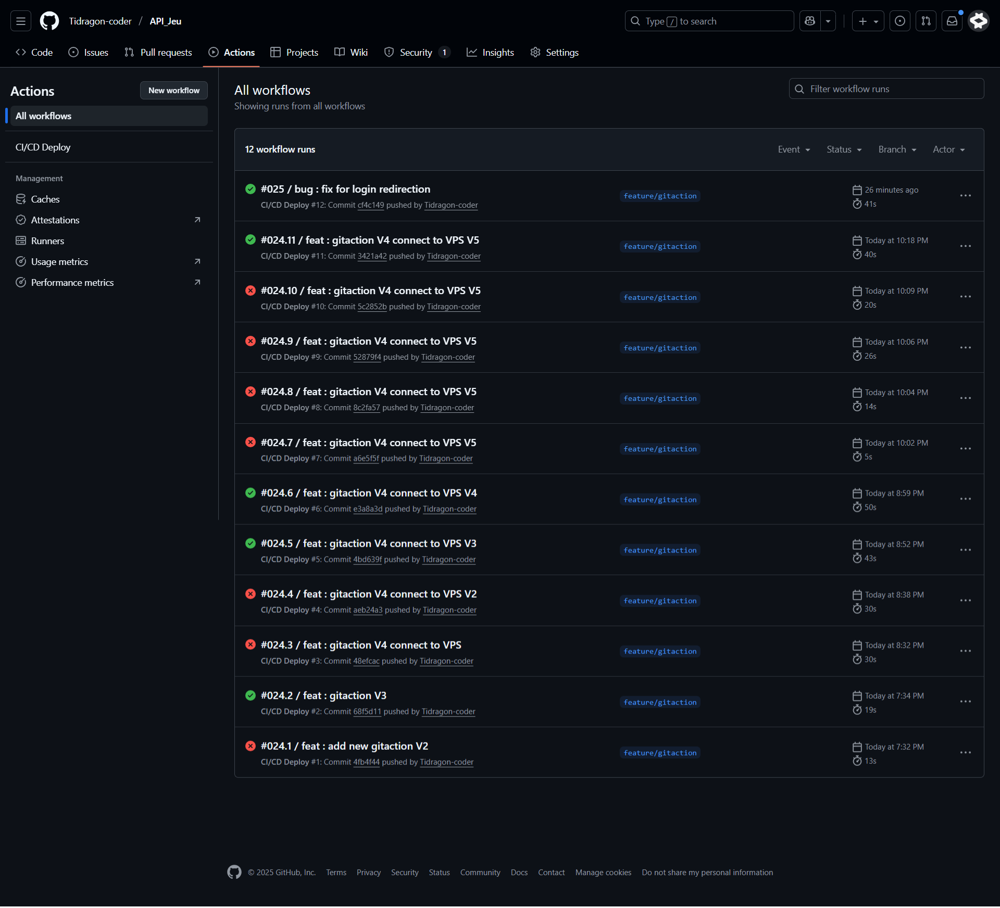
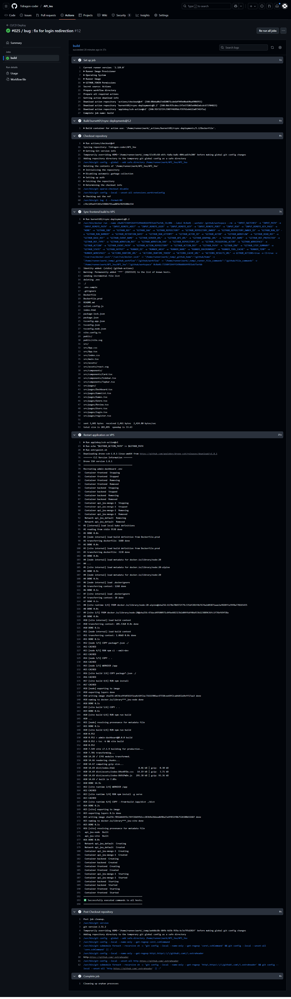

# TP — Déploiement CI/CD Frontend & Backend Docker

## 1 Architecture de déploiement

- **Frontend** : React, servi depuis un container Docker sur le VPS.  
- **Backend** : Node.js, servi depuis un container Docker sur le VPS.  
- **Pipeline CI/CD** : GitHub Actions  
  - Build frontend sur le runner GitHub (si nécessaire)  
  - Transfert du frontend via `rsync` sur le VPS  
  - Relance automatique des containers Docker frontend & backend  

---

## 2️ Secrets utilisés

| Secret GitHub | Utilisation |
|---------------|------------|
| `VPS_HOST` | Adresse IP ou domaine du VPS |
| `VPS_USER` | Utilisateur SSH pour le VPS |
| `SSH_PRIVATE_KEY` | Clé privée SSH pour se connecter au VPS |
| `VPS_PATH` | Dossier cible sur le VPS pour le frontend |
| `VITE_API_URL` | URL de l'API backend |

---

## 3 Triggers

- Pipeline déclenchée sur push vers la branche : `feature/gitaction` 

---

## 4 Check-list de validation

- ✅ Build frontend exécuté avec succès

- ✅ Transfert via rsync sur le VPS réussi

 - ✅ Containers Docker frontend & backend relancés avec succès

 - ✅ URLs publiques fonctionnelles

  - ✅ Logs CI/CD consultables

--- 

## 6 URLs publiques

Frontend (VPS) : http://31.207.35.91

---

## 7 Captures d’écran

